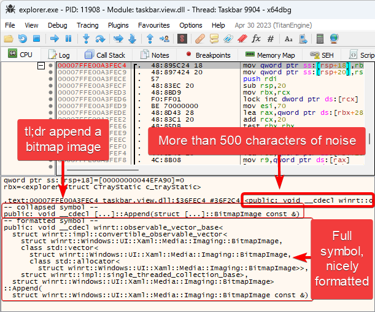

# x64dbg Symbol tl;dr Plugin

An x64dbg plugin which helps make sense of long C++ symbols. Some heavily
templated C++ symbols can reach hundreds of characters in length, making them
difficult to read. The plugin adds two versions of the symbol to the info box,
a collapsed version of the symbol which omits templates and namespaces, and a
formatted version of the symbol which is easier to read.

